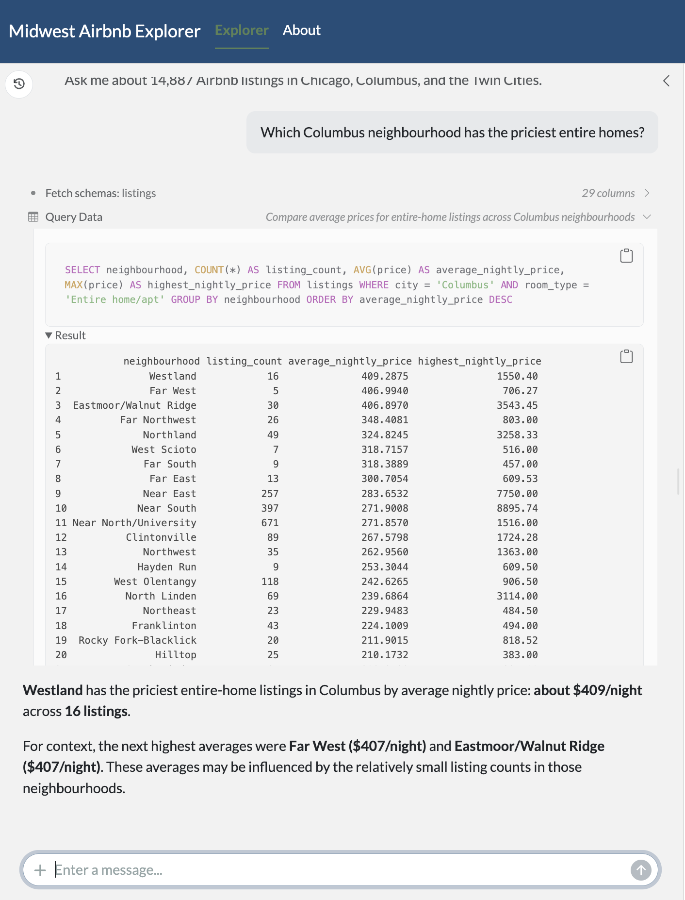
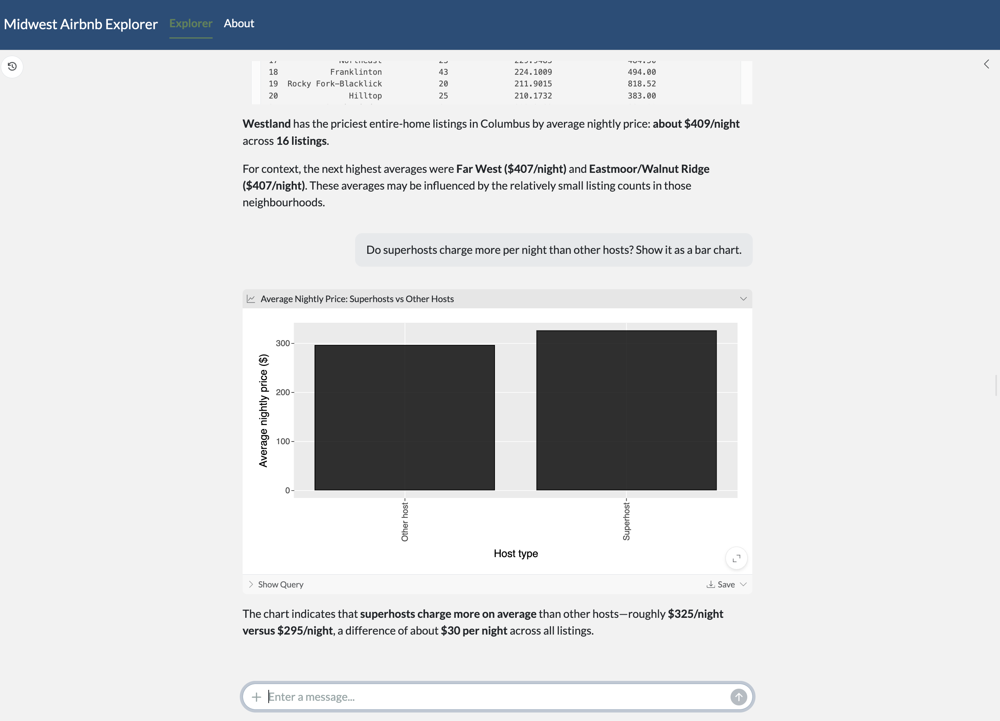
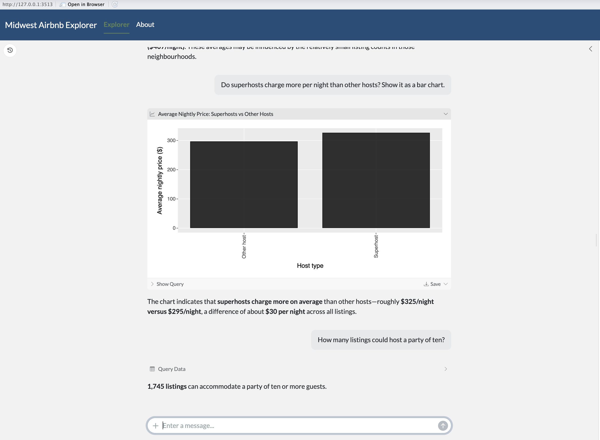

# Midwest Airbnb Explorer

**Ask a question in plain English, get the SQL and a table back**

A [querychat](https://github.com/posit-dev/querychat) app built for Assignment 05 in ISA 401 (Miami University). It rebuilds the class Job Scout Chat app on [Inside Airbnb](https://insideairbnb.com/get-the-data/) listings for Chicago, Columbus, and the Twin Cities, and is deployed to [Render](https://render.com) from this GitHub repository.

**Live app:** https://midwestairbnbchat.onrender.com

---

## Example Questions

**1. Which Columbus neighbourhood has the priciest entire homes?**



**2. Do superhosts charge more per night than other hosts? Show it as a bar chart.**



**3. How many listings could host a party of ten?**



---

## What is this app?

The app connects to a SQLite database (`data/midwest_airbnb.db`), hands the `listings` table to querychat, and lets an LLM translate your question into SQL. It has two tabs:

- **Explorer:** the chat sits in the sidebar. A SQL panel above the table always shows the SQL behind the latest answer, whether it filtered the table, answered in the chat, or drew a chart, so you can check the logic and reuse the SQL yourself.
- **About:** the data source (Inside Airbnb), the three cities and their snapshot dates, and who built the app.

The app uses its own Bootstrap 5 theme from [bslib](https://rstudio.github.io/bslib/).

---

## Dataset Information

**Dataset:** `listings` table in `data/midwest_airbnb.db` (14,887 rows, 29 columns)
**Source:** Inside Airbnb's detailed `listings.csv.gz` files for Chicago (snapshot 2026-07-20), Twin Cities MSA (2026-07-21), and Columbus (2026-07-23). Only listings that showed a nightly price on the snapshot date are included.
**Data dictionary:** `data/data_desc.md` (all 29 columns)
**Query rules for the LLM:** `data/extra_instructions.md` (four rules)

### Key Fields

| Field | Description |
|-------|-------------|
| `city` | `Chicago` (7,439 rows), `Twin Cities` (4,861), or `Columbus` (2,587) |
| `neighbourhood` | Community area in Chicago, planning area in Columbus, **county** in the Twin Cities |
| `room_type` | `Entire home/apt`, `Private room`, `Hotel room`, or `Shared room` |
| `price` | Nightly price in U.S. dollars (2.56 to 11,412) |
| `accommodates` | Maximum number of guests (1 to 16) |
| `host_is_superhost` | Text `'t'` or `'f'`, not a boolean |
| `review_scores_rating` | Average guest rating on a 1-to-5 scale; `NULL` for the 1,761 listings with no reviews |
| `estimated_revenue_l365d` | Inside Airbnb's modelled revenue for the last 365 days, not actual earnings |

**Known gaps:** `host_since` and `instant_bookable` are `NULL` in every row, so the app cannot answer questions about host tenure or instant booking.

---

## Required Secret

The app calls OpenAI (`gpt-5.6-luna (reasoning off)`) through [ellmer](https://ellmer.tidyverse.org/), so it needs one environment variable:

```bash
export OPENAI_API_KEY="your-api-key-here"
```

For local runs, put `OPENAI_API_KEY=...` in the project's `.Renviron` (at the root of `business_intelligence/`), then use **Session > Restart R** in RStudio. On Render, add it under **Environment** as an environment variable named `OPENAI_API_KEY`. Never commit the key to `app.R`, `.Renviron`, or this README; `.Renviron` is listed in `.gitignore` for that reason.

---

## Running Locally

**With R (4.6.0, querychat 0.3.0 or later):**
```r
install.packages(c("shiny", "bslib", "DBI", "RSQLite", "ellmer", "shinychat", "querychat", "DT", "ggsql"))

# from inside apps/midwest_airbnb_chat/
shiny::runApp(".", port = 7860)
```

If `ggsql` is not installed, the app still runs, but the chat cannot answer with charts.

**With Docker:**
```bash
docker build -t midwest_airbnb_chat .
docker run --rm -p 7860:7860 -e OPENAI_API_KEY=$OPENAI_API_KEY midwest_airbnb_chat
```

Then open http://localhost:7860.

---

## Technology Stack

- **[Shiny](https://shiny.posit.co/)** - Web application framework for R
- **[bslib](https://rstudio.github.io/bslib/)** - Bootstrap 5 themes and layouts for Shiny
- **[querychat](https://github.com/posit-dev/querychat)** - Natural language data querying
- **[ellmer](https://ellmer.tidyverse.org/)** - LLM client for R
- **[RSQLite](https://rsqlite.r-dbi.org/)** - SQLite driver for R
- **[DT](https://rstudio.github.io/DT/)** - Interactive data tables

---

## Course Information

Built by **Jack Hibbard** for **ISA 401** at **Miami University**, starting from the class Job Scout Chat app. The polished version of the same idea, built on BLS wage data, is the [OEWS Jobs Explorer](https://huggingface.co/spaces/fmegahed/querychat_demo).
